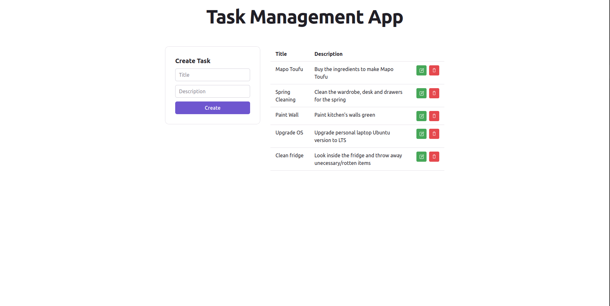

# Integration Engineer Test

We appreciate your interest in the Integration Engineer role at our company. This test helps us understand your skills in creating a Node.js backend API and a ReactJS frontend. You should finish the test within a few hours. Please read the instructions carefully.

## Task Overview:

Your task is to build a simple task management application. This template offers a basic setup for a React frontend using Vite, which connects to a Node/Express backend. Users should be able to view, create, update, and delete tasks.

There are different parts to this exercise:

1. Set up the backend and frontend, resolving any issues that may arise (some issues might not have been noticed by the original developer since 'it works locally').
2. Complete the endpoints for task creation and deletion.
3. Implement missing functions in the React frontend to interact with the new endpoints for task creation and deletion.
4. Develop a new endpoint in the Express app for updating tasks. Create a UI allowing users to update tasks and communicate with this new endpoint.
5. Update the CSS to improve the usability of the solution.

_Additional Information_

- Tasks should be stored temporarily in memory; permanent storage is not necessary.
- Prevent creating or updating tasks with empty titles or descriptions. Display an error if users attempt to submit an invalid task. (Your backend should handle this check and return an error.)
- No guidance is available from the previous developer on setting up the project on a new machine. You'll need to use the existing files to figure it out, considering possible mistakes.
- The backend is in JavaScript, while the frontend React code is in a .tsx file. Make sure your work is valid TypeScript.
- Enable CORS support in the API to permit cross-origin requests.
- The app's rudimentary styling by the previous developer can be improved for better user experience.
- BONUS: If you can optimize the React app's rendering for efficiency, feel free to make changes.

_Submission Guidelines_

- Fork this GitHub repository to your own GitHub account.
- Develop the backend and frontend using the provided directory structure.
- Edit this README below to explain how to run both the backend and frontend.
- Once done, share the link to your forked repository via email.

_Evaluation Criteria_

- Functionality: Does the app meet the requirements and work error-free?
- Code Quality: Is the code well-structured, modular, and easy to understand?
- API Design: Did you design the API in a RESTful way? Is error handling and validation effective?
- Frontend Design: Is the frontend user-friendly, responsive, and visually appealing?
- Git Usage: Are your commits meaningful and code changes well-tracked?
- Documentation: Are instructions provided for setting up the app on a new machine?

Use this opportunity to showcase your skills. If you see fit, add extra features or improvements.

Please note that this test aims to be completed in a few hours. However, quality work is more important than speed. If you have questions, feel free to email us.

Best wishes, and we're excited to review your submission!

Regards,
The Duda Solutions Engineering Team

## Add any instructions to get your submission running below this line.

# Task Manager App



This fullstack application for managing your tasks!

The project stack is:

- Backend: [Node.JS](https://nodejs.org) and [Express.JS](https://expressjs.com/)
- Frontend: [Vite](https://vite.dev/), [React.JS](https://react.dev/) and [TypeScript](https://www.typescriptlang.org/)
- Validation: both the backend and frontend use [Zod](https://zod.dev/) for validation

The tasks are not persisted in a database, only on the server memory.

## UI

A task can be created in the form:


The tasks can be read in the table:


A task can be edit through the dialog opened by the edit button in the table:


A task can be deleted through the remove button in the table:


## Structure

The project structure is as follows:

The backend code is in the `index.js` file and the `backend` directory.

The frontend code is another project inside the `frontend` directory, it's bundled by Vite

## Commands

### Backend

To run the backend it's necessary to install all its dependencies by running `npm install`

To run the backend code in development mode:

```bash
npm run dev
```

To run the backend code in production mode:

```bash
npm run start
```

Those command only starts backend code

### Frontend

To access the code, you should first `cd` into it by using `cd frontend`

Once in the `frontend` directory, start by installing its dependencies by running `npm install`

To run the code in development mode:

```bash
npm run dev
```

To run build the code:

```bash
npm run build
```

To run lint the code:

```bash
npm run lint
```

To preview the production code:

```bash
npm run preview
```
